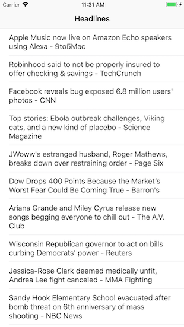

NewsFeed application
====================

This app displays a list of top news stories from newsapi.org. Headlines are displayed in a table view.
When a headline is tapped, an ArticleViewController is instantiated and pushed on the navigation stack.
The article view includes the title, author and publication time of the article, if all fields are present.
The full article is shown below in a webview. The navigation title displays the name of the news source.

Notes
-----

- The headlines view should display a thumbnail for each headline.
- The headlines view should support refreshing to reload the latest headlines.
- The headlines view should allow the user to load more stories via infinite scrolling or another mechanism.
- The article view should display a loading spinner while the webview is loading.
- General error handling should be improved.
